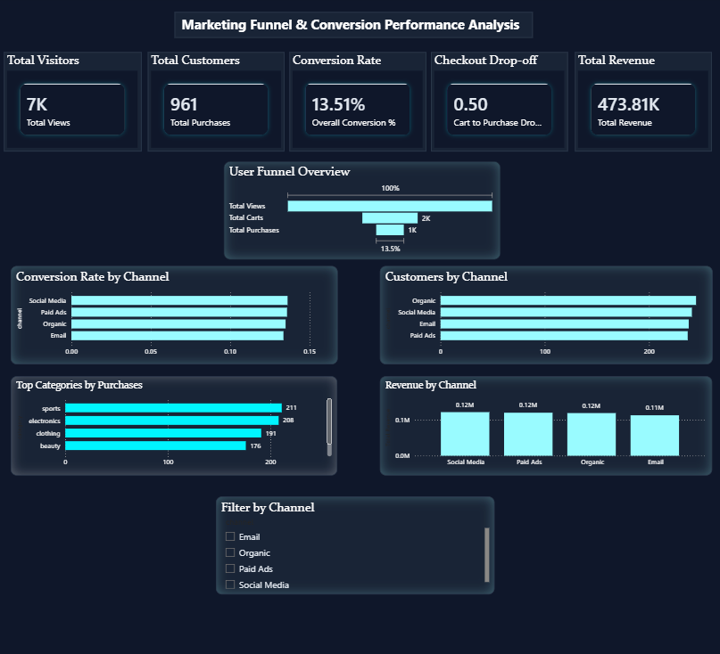

# 📊 Marketing Funnel & Conversion Performance Analysis

## 🔍 Overview
This project analyzes a marketing funnel to understand how users move from visitors → carts → customers and identifies key drop-off points impacting conversion rates.

The objective is to transform raw data into actionable insights that help improve marketing performance and drive revenue growth.

---

## 🎯 Objectives
- Analyze user behavior across funnel stages  
- Measure conversion rates  
- Identify major drop-off points  
- Compare performance across marketing channels  
- Provide data-driven recommendations  

---

## 📁 Dataset
The dataset represents a simulated e-commerce funnel and includes:
- User events (views, carts, purchases)  
- Marketing channels (Organic, Paid Ads, Social Media, Email)  
- Product categories  
- Revenue data  

---

## 📊 Dashboard Features

### 🔹 KPI Metrics
- Total Visitors  
- Total Customers  
- Conversion Rate  
- Checkout Drop-off Rate  
- Total Revenue  

### 🔹 Funnel Analysis
- Visual representation of user journey (Views → Carts → Purchases)  
- Identification of key drop-off stage  

### 🔹 Channel Performance
- Customers by Channel  
- Conversion Rate by Channel  
- Revenue by Channel  

### 🔹 Category Insights
- Top Categories by Purchases  

---

## 🔍 Key Insights
- Approximately 50% drop-off occurs at the checkout stage  
- Organic and Social Media channels generate the highest number of customers  
- Conversion rates are relatively consistent across all channels  
- Revenue contribution is evenly distributed, with slight variation across channels  

---

## 💡 Recommendations
- Optimize checkout process to reduce cart abandonment  
- Invest more in high-performing channels (Organic & Social Media)  
- Improve targeting for underperforming channels  
- Implement retargeting strategies for users who abandon carts  

---

## 🛠️ Tools Used
- Power BI  
- Microsoft Excel  

---

## 📸 Dashboard Preview

---

## 📂 Repository Structure
marketing-funnel-analysis/
│
├── ecommerce_with_channel.xlsx
├── funnel_dashboard.pbix
├── funnel_dashboard.png
└── README.md

---

## 🚀 Key Learnings
- Funnel and conversion analysis  
- KPI tracking and business metrics  
- Data visualization and storytelling  
- Turning data into actionable insights  

---

## 👤 Author
Siddhi Malode
Aspiring Data Analyst | Power BI Enthusiast  

---

## 📢 Acknowledgment
This project was completed as part of a Data Analytics task by Future Interns, simulating a real-world marketing funnel analysis scenario.
